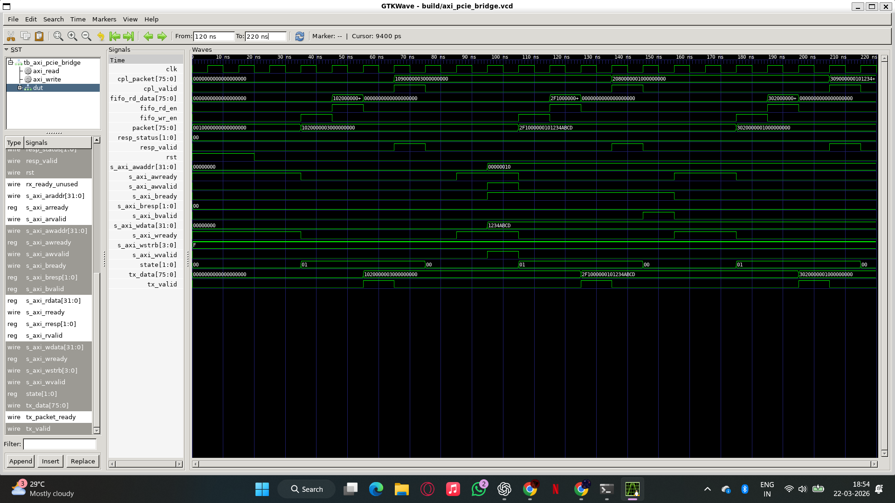
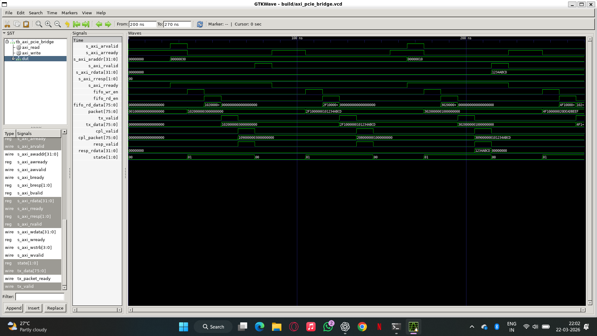
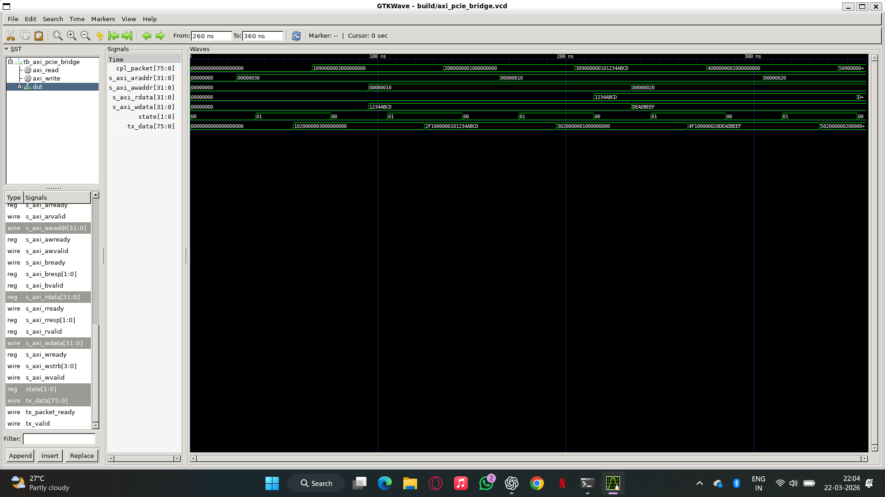

# AXI4-Lite to PCIe-Style Transaction Bridge in Verilog

## Overview
This project implements a simplified AXI4-Lite to PCIe-style transaction bridge in Verilog. It converts AXI memory-mapped read/write requests into internal packetized transactions and returns completion responses back to the AXI interface.

The design models transaction-layer behavior including buffering, FSM control, and completion handling.

---

## Architecture

AXI → Packet Builder → FIFO → TX Engine → RX Engine → Completion Manager → AXI Response

### Key Components
- AXI4-Lite Slave Interface
- Packet Builder (internal PCIe-style format)
- FIFO Buffer (decouples AXI and TX)
- TX Engine (handles packet transmission)
- RX Engine (models memory + completion)
- Completion Manager (maps responses to AXI)
- Config Registers (address range control)
### Block Diagram
AXI → Packet Builder → FIFO → TX → RX → Completion → AXI Response
---

## Packet Format

| Field        | Bits       |
|-------------|-----------|
| Tag         | [75:72]   |
| Byte Enable | [71:68]   |
| Type        | [67:64]   |
| Address     | [63:32]   |
| Data        | [31:0]    |

### Packet Types
- `4'h1` → Write Request  
- `4'h2` → Read Request  
- `4'h8` → Completion (no data)  
- `4'h9` → Completion (with data)  
- `4'hF` → Error  

---

## Verification

### Functional Tests
- Read from empty memory → returns 0  
- Write → Readback verification  
- Multiple address transactions  

### Design Features Verified
- FIFO buffering  
- Completion-based response handling  
- Address range filtering  

---

## Waveform Proof

### Write Transaction Flow


### Read Transaction Flow


### Write → Readback Verification


---

## How to Run

```bash
iverilog -g2012 -Wall -o build/axi_pcie_bridge.out \
rtl/*.sv tb/*.sv

vvp build/axi_pcie_bridge.out

gtkwave build/axi_pcie_bridge.vcd
# AXI4-Lite to PCIe-Style Transaction Bridge in Verilog

## Overview
This project implements a simplified AXI4-Lite to PCIe-style transaction bridge in Verilog. It converts AXI memory-mapped read/write requests into internal packetized transactions and returns completion responses back to the AXI interface.

The design models transaction-layer behavior including buffering, FSM control, and completion handling.

---

## Architecture

AXI → Packet Builder → FIFO → TX Engine → RX Engine → Completion Manager → AXI Response

### Key Components
- AXI4-Lite Slave Interface
- Packet Builder (internal PCIe-style format)
- FIFO Buffer (decouples AXI and TX)
- TX Engine (handles packet transmission)
- RX Engine (models memory + completion)
- Completion Manager (maps responses to AXI)
- Config Registers (address range control)

---

## Packet Format

| Field        | Bits       |
|-------------|-----------|
| Tag         | [75:72]   |
| Byte Enable | [71:68]   |
| Type        | [67:64]   |
| Address     | [63:32]   |
| Data        | [31:0]    |

### Packet Types
- `4'h1` → Write Request  
- `4'h2` → Read Request  
- `4'h8` → Completion (no data)  
- `4'h9` → Completion (with data)  
- `4'hF` → Error  

---

## Verification

### Functional Tests
- Read from empty memory → returns 0  
- Write → Readback verification  
- Multiple address transactions  

### Design Features Verified
- FIFO buffering  
- Completion-based response handling  
- Address range filtering  

---

## Waveform Proof

### Write Transaction Flow


### Read Transaction Flow


### Write → Readback Verification


---

## How to Run

```bash
iverilog -g2012 -Wall -o build/axi_pcie_bridge.out \
rtl/*.sv tb/*.sv

vvp build/axi_pcie_bridge.out

gtkwave build/axi_pcie_bridge.vcd

---

## Results

- Successfully translated AXI4-Lite read/write transactions into packetized PCIe-style requests
- Verified correct read/write and readback behavior across multiple addresses
- Demonstrated FIFO-based buffering between request and transmission stages
- Validated completion-driven response handling back to AXI interface

---

## Testbench

- Directed stimulus for AXI read and write transactions
- Integrated memory model within RX engine for completion responses
- Verified completion packet handling and AXI response mapping
- Generated waveform-based validation using GTKWave

---

## Waveform Proof

### Write Transaction Flow


### Read Transaction Flow


### Write → Readback Verification

